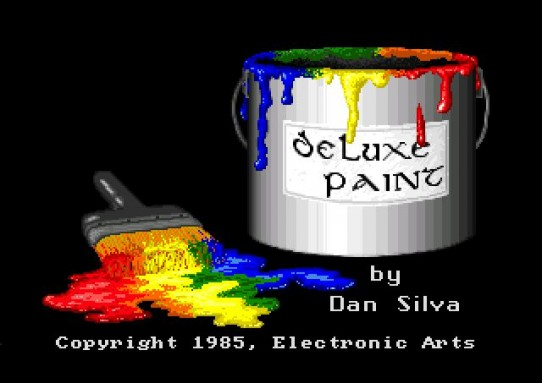
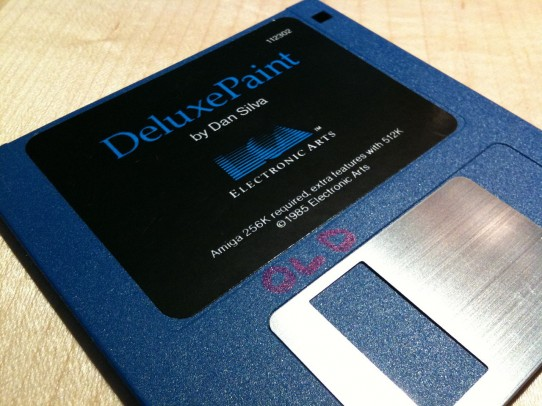
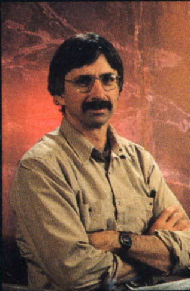
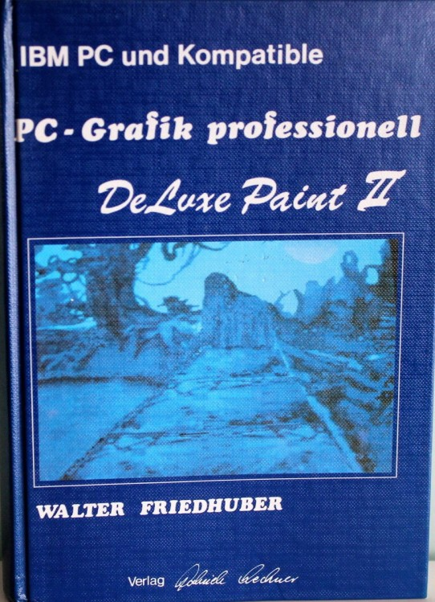

[![Contributors][contributors-shield]][contributors-url]
[![Forks][forks-shield]][forks-url]
[![Stargazers][stars-shield]][stars-url]
[![The Unlicense][license-shield]][license-url]
[![Issues][issues-shield]][issues-url]
[![LinkedIn][linkedin-shield]][linkedin-url]

---

# Electronic Arts DeluxePaint

    
      
    <strong><a href="https://github.com/msammels/DeluxePaint/tree/main/src">Explore the code »</a></strong>

> DeluxePaint is a graphics tool that can you create works of art with an ease and precision that you may never have
> thought possible[^1]

# About the Project
By the mid-1980s, mass-produced personal computers had finally become powerful enough to be used for graphics.
Apple had released their drawing program MacPaint[^5] with the first Macintosh in 1984. But at $2500 the Mac was
expensive, and it only displayed black and white images.

|  |
|:-----------------------------------------------------------------------------------------:|
|              <cite><strong>The splash screen for DelxuePaint</strong></cite>              |

The Commodore Amiga, introduced the next year, cost half as much[^2], and it had color. But although it came with a
sophisticated operating system, there were no bundled graphics applications. That opened the door for other software
companies, and some jumped right in.

Dan Silva created DeluxePaint in 1985 at Electronic Arts, a then 3-year-old publisher of computer games. The initial goal
was to write an internal graphics design program, called “Prism”, for creating game artwork at EA. But it quickly became
clear that it was a general-purpose design tool that might have broad appeal outside of EA. The first version of what
became called DeluxePaint was released at the same time as the Amiga at the end of 1985 at an introductory price of
$79.95, and was sold later for $99.95.

|  |
|:------------------------------------------------------------------------------------------------:|
|                <cite><strong>The disk for DelxuePaint on the Amiga</strong></cite>               |

It was a hit. A review in the April 1986 issue of “Compute!” magazine[^4] called DeluxePaint “a visual arts program of
immense scope and flexibility... Virtually anything that anyone ever wanted in a personal computer graphics program is
included in DeluxePaint — and it’s all easy to use and easy to learn.”

DeluxePaint became the standard graphics editor for the Amiga, and it rode the wave of Amiga's success.

We have found both the manual[^6] and the reference card[^7] for DeluxePaint version 1. To see how the program began to
evolve, check out the manual for DeluxePaint version II[^1].

Video: a tutorial on the use of DeluxePaint III from 1989, which also contains clips of Dan Silva talking about its
history and new features.

<a href="#">🔝</a>

# How It Came To Be: "I wasn't into programming in the abstract"
In a video interview for a later version of DeluxePaint, author Dan Silva describes the path to his interest in
graphics starting in the 1960s.

> I got into computer graphics in not the most direct way. I actually started out in mechanical engineering, but when I
> was going to school — which was originally at Stanford — there wasn’t any computer graphics department. As a matter of
> fact, there wasn’t anything called computer graphics that I had ever heard about. I got into using computers in mechanical
> engineering to synthesize three-dimensional kinematic linkages, which sounds pretty complicated but actually involved
> many of the same concepts that you use in computer graphics. When I started working at other jobs – I worked at NASA Ames
> doing scientific programming – I did everything I could to get my hands on equipment that I could create computer
> graphics with, because I just felt a real need to create some sort of tangible output. I wasn’t into programming in
> the abstract.

|  |
|:--------------------------------------------------------------------:|
|           <cite><strong>Dan Silva, ca. 1986</strong></cite>          |

In 1978 Dan worked for Xerox doing user interface design for the Xerox Star computer. Then he spent a year at the
newly-formed computer group at Lucasfilm, where he designed a video editor. He returned to Xerox, where he worked with
Bill Bowman to create a black and white paint program called Doodle for the Xerox Dandelion computer.

By the time he joined Electronic Arts in 1983, Dan had a clear idea of how the ideal paint program should behave.
Like most programs that are plowing new ground, DeluxePaint started out modestly.

> The first version of DeluxePaint that I got going on the Amiga had no menus. I basically got the skeleton of the program
> going, and it was all keystrokes. You could do anything. The first paintings on that program were done by Avril Harrison.
> As I recall she did them without any menus, using the PICK command to pick colors out of the screen, and it worked fine.

The released version had a menu system, but still allowed simultaneous keyboard commands, which was a productivity
feature for power users.

> One of the aspects of DeluxePaint which I sometimes feel gets lost in the comparative feature list ...is the way the user
> interface is designed. First of all, I went to great pains to come up with a control structure so that when you’re drawing
> a curve or drawing a circle, you can still use the key commands to change the size or color of the brush. Even though
> DeluxePaint can be used with just menus and without the keyboard commands, the design is set up so that it’s better
> if you know how to use the keyboard commands. As a matter of fact, I think there are certain of the keyboard commands
> that people overlook that are essential to really understanding how the program is meant to work. For instance,
> the “g” key to turn on and off the grid – you can go over to the menu to do that, but if you use the key, you can do it
> while you’re in the midst of an operation such as drawing a circle. For instance, if you want to draw a circle with its
> center at the same point as another circle, you can use the grid to center it. Then while you’re stretching the circle
> out, you can use “g” to turn the grid off so you aren’t constrained by the grid anymore. Writing such a sophisticated
> program for a relatively small computer like the Amiga was a challenge. Remarkably, it could run in an Amiga with a
> floppy disk and just 256 KB of main memory, although 512 KB was recommended. Depending on the size of memory and the
> screen resolution chosen (from 320 x 200 to 640 x 400), modules of the program might need to be repeatedly swapped in
> from the disk. As limited by the capabilities of the Amiga display hardware, each image could use up to 16 or 32 colors
> chosen from a palette of 4,096 possible colors.

|  |
|:--------------------------------------------------------------------------------------:|
|            <cite><strong>A German manual for DeluxePaint II</strong></cite>            |

Although Silva wrote most of the original code, there were also contribution form Jerry Morrison and Steve Shaw for
routines that transferred bitmaps to and from "interleaved bitmap" (`.lmb`) files on the disk, and from Gordon Knopes
for some of the early colour pixel processing.

Although MacPaint was released before DeluxePaint, there was little connection. Silva says,

> "I had developed most of the underlying functionality before I saw MacPaint, but I thought it was pretty cool. I
> think the positioning of the menu icons on the right side was probably influenced by MacPaint."

Like most products with a long lifetime, DeluxePaint started out simple and became increasing more powerful and more
complex to use. On June 27, 1989, Dan Silva appeared on Stewart Cheifet’s “Computer Chronicles” TV show[^3]
to talk about the upcoming release of DeluxePaint III, which added features to create animations.

Versions of DeluxePaint were eventually created for PCs running MS-DOS, for the Atari ST, and for the Apple IIGS.
There were manuals and books about it in various languages, including German. The last version for the Amiga, version V,
was released in 1994.

DeluxePaint was a good program with a good long run.

<a href="#">🔝</a>

# Contact
Michael Sammels - [@msammels](https://twitter.com/msammels) | michael@sammels.net

[contributors-shield]:  https://img.shields.io/github/contributors/msammels/DeluxePaint?style=for-the-badge
[contributors-url]:     https://github.com/msammels/DeluxePaint/graphs/contributors

[forks-shield]:         https://img.shields.io/github/forks/msammels/DeluxePaint?style=for-the-badge
[forks-url]:            https://github.com/msammles/DeluxePaint/network/members

[stars-shield]:         https://img.shields.io/github/stars/msammels/DeluxePaint?style=for-the-badge
[stars-url]:            https://github.com/msammels/DeluxePaint/stargazers

[issues-shield]:        https://img.shields.io/github/issues/msammels/DeluxePaint?style=for-the-badge
[issues-url]:           https://github.com/msammels/DeluxePaint/issues

[license-shield]:       https://img.shields.io/github/license/msammels/DeluxePaint.svg?style=for-the-badge
[license-url]:          https://github.com/msammels/DeluxePaint/blob/main/LICENSE

[linkedin-shield]:      https://img.shields.io/badge/-LinkedIn-black.svg?style=for-the-badge&logo=linkedin&colorB=555
[linkedin-url]:         https://linkedin.com/in/msammels

[^1]: DeluxePaint II Manual, 1987, p1.1, <a href="https://apple2online.com/web_documents/Delux%20Paint%20II%20Users%20Manual%20&%20Reference%20Card.pdf">DeluxePaint II Manual</a>
[^2]: Without the monitor, which was an additional $300. But you could also use a colour television.
[^3]: The Computer Chronicles, ”The New Amigas”, program #613U, aired June 27, 1989 on KCSM-TV, https://archive.org/details/amiga_3 , starting at 16:47
[^4]: Compute! magazine, April 1986, pps 52-58, <a href="https://d1yx3ys82bpsa0.cloudfront.net/atchm/documents/Compute_Issue_071_1986_Apr_DeluxePaint_review.pdf">Compute Issue 071 1986 Apr DeluxePaint review</a>
[^5]: <a href="https://github.com/msammels/MacPaint-QuickDraw">MacPaint and QuickDraw Source Code</a>
[^6]: DeluxePaint, “The Manual”, Electronic Arts, 1985, <a href="https://d1yx3ys82bpsa0.cloudfront.net/atchm/documents/DeluxePaint_I_manual.pdf">DeluxePaint I Manual</a>
[^7]: DeluxePaint “Reference Card and Manual Additions”, Electronic Arts, 1985, <a href="https://d1yx3ys82bpsa0.cloudfront.net/atchm/documents/DeluxePaint_I_refcard.pdf">DeluxePaint Reference Card</a>